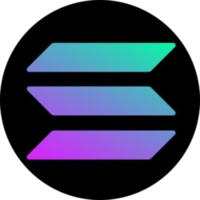

# Hi, I'm Karn
- I'm not on Solana space anymore (but soon will be back lol) as I barely have time but you can ask me about Solana development stuff. I can answer your question to some extents as my knowledge regarding Solana development might have been outdated.
- I was a part time developer at [MyCodeKit](https://mycodekit.com/) in UK.
- 💻 I was a lead full-stack developer at [Atadia.io](https://www.atadia.io/)
  - I led the developtment of [P2P lending platform](https://lending.atadia.io/) on Solana Blockchain. (If you want to try it out without using real SOL, you can try on [P2P lending - devnet](https://lendinglab-mg6fwvzq3a-as.a.run.app/) instead.
  - I developed various core features for [Atadia V1 product](https://product.atadia.io/), which includes features like Token Staking, Lending Lab (closed and moved to P2P Lending Platform), Minting (ATAPass) and Wallet Authorization.
-  I wrote and deployed 4 entire on-chain programs (smart contracts) on the Solana Blockchain for Atadia.
  - The $ATA (Fungible Token) and NATD (NFT) staking smart contract with dynamic rewards: [AtA3riahYEopN59jQu6gTL8Dix7XKunY2PBH3jnRv55u](https://solscan.io/account/AtA3riahYEopN59jQu6gTL8Dix7XKunY2PBH3jnRv55u)
  - The OGA (NFT) staking smart contract with constant rewards: [oGA1rHb9aGa4i24V1bQHZMGbH2qyWFV9nU6Mcj57cof](https://solscan.io/account/oGA1rHb9aGa4i24V1bQHZMGbH2qyWFV9nU6Mcj57cof)
  - VOGA (NFT) in-wallet staking: [VGAurSiJ7bjAHSEa5sdiK1XDYqgw8q6GrBYyrUjoCY2](https://solscan.io/account/VGAurSiJ7bjAHSEa5sdiK1XDYqgw8q6GrBYyrUjoCY2)
  - p2p lending: [P2Pj8hKKJLxsZphrP2bRUumxgzLiNk67i8DjyjJUzPv](https://solscan.io/account/P2Pj8hKKJLxsZphrP2bRUumxgzLiNk67i8DjyjJUzPv)
- 🌓 My hobby project
  - FT Trading (On Going) : [Site](https://s3t-trade.vercel.app/), [repo](https://github.com/KKQanT/ft-trading-fe)
  - FT Trading Smart Contract: [S3TX6wejVn7n9d7CPtLySdBaaTgu8RdMCByrCDpEkR4](https://explorer.solana.com/address/S3TX6wejVn7n9d7CPtLySdBaaTgu8RdMCByrCDpEkR4?cluster=devnet), [repo](https://github.com/KKQanT/ft-trading)
- 📈 I'm a former data scientist at [Siametrics Consulting](https://www.siametrics.com/).

---

## Tools

## Frameworks

## Languages

